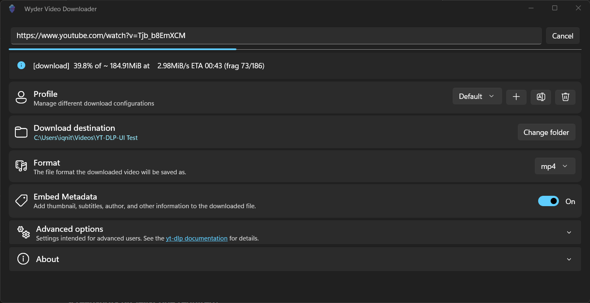

# Wyder Video Downloader

An intuitive and powerful video downloader for Windows based on the [yt-dlp project](https://github.com/yt-dlp/yt-dlp) that allows you to download videos from various platforms, including YouTube, TikTok, Twitch, and many more.

## Features

- Download from 100+ sites
- Download as mp4 or mp3
- Download entire playlists or channels
- Download with original subtitles, thumbnail, and metadata
- Support for advanced yt-dlp options
- Multi-Profile support for configuration management

## AI Usage Disclaimer

This project is made by a human developer and is not "vibe-coded". However, AI tools were used for tasks such as boilerplate generation, code review, debugging, and research. AI outputs were carefully reviewed and adapted to ensure the quality and functionality of the application. All icons, graphics, and texts are completely hand-made.
